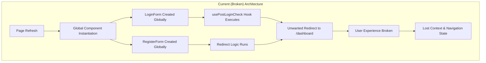
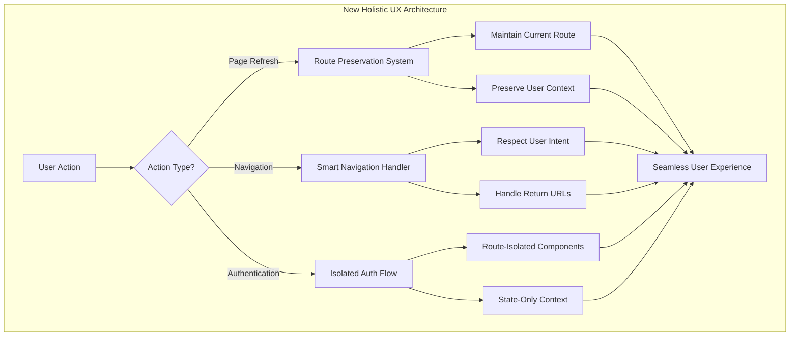
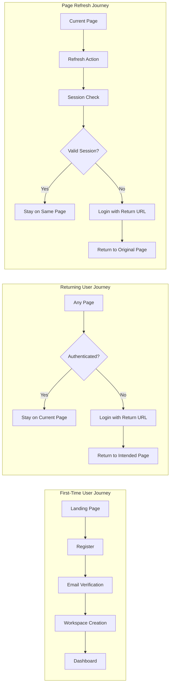
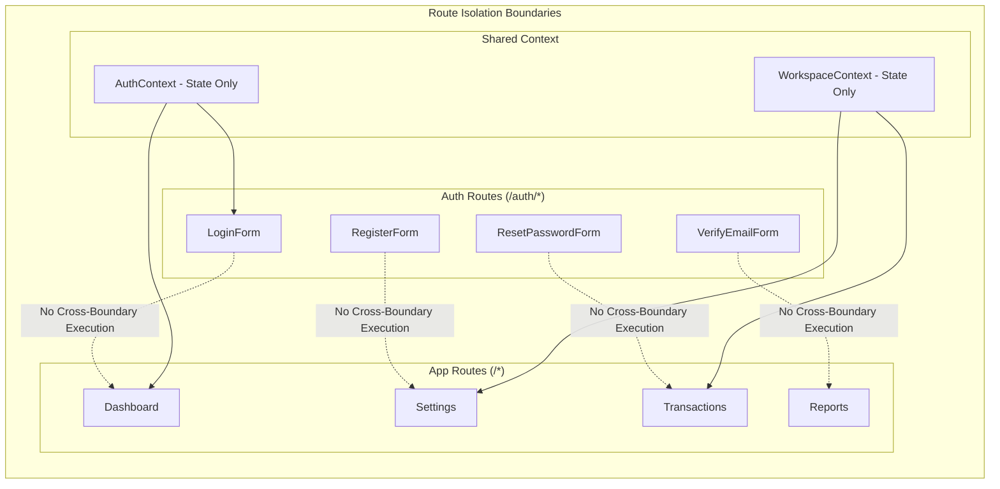

# Design Document: Authentication Page Refresh Fix

## Overview

This design addresses the critical page refresh redirect issue in Forma's authentication system. The root cause is **global component instantiation** - authentication components are being created and executed outside their intended routes, causing unwanted redirects when users refresh pages.

The solution implements a **Route-Isolated Authentication Architecture** that ensures authentication components only execute within their designated routes, while maintaining proper session management and route preservation across page refreshes.

## Architecture

### Current Problem Architecture



### New Comprehensive User Experience Architecture



### Complete User Journey Flow



### Component Isolation Strategy



## Components and Interfaces

### Route-Isolated Authentication Components

#### AuthPageGuard Component
```typescript
interface AuthPageGuardProps {
  children: React.ReactNode
  requiredPath: string
  fallback?: React.ReactNode
}

/**
 * Ensures auth components only render on their designated routes
 */
export function AuthPageGuard({ 
  children, 
  requiredPath, 
  fallback = null 
}: AuthPageGuardProps) {
  const pathname = usePathname()
  
  // Only render children if on the correct route
  if (pathname !== requiredPath) {
    return <>{fallback}</>
  }
  
  return <>{children}</>
}
```

#### Isolated Authentication Forms
```typescript
// LoginForm with route isolation
export function LoginForm() {
  return (
    <AuthPageGuard requiredPath="/auth/login">
      <LoginFormImplementation />
    </AuthPageGuard>
  )
}

// RegisterForm with route isolation
export function RegisterForm() {
  return (
    <AuthPageGuard requiredPath="/auth/signup">
      <RegisterFormImplementation />
    </AuthPageGuard>
  )
}
```

#### State-Only Authentication Context
```typescript
interface AuthContextType {
  // State access only - no navigation side effects
  user: User | null
  session: Session | null
  loading: boolean
  isAuthenticated: boolean
  
  // Actions that don't trigger automatic redirects
  signIn: (email: string, password: string) => Promise<AuthResult>
  signUp: (email: string, password: string, fullName: string) => Promise<AuthResult>
  signOut: () => Promise<void>
  resetPassword: (email: string) => Promise<AuthResult>
  
  // Session validation without side effects
  validateSession: () => Promise<boolean>
}

/**
 * Provides authentication state without navigation side effects
 */
export function AuthProvider({ children }: { children: React.ReactNode }) {
  const [user, setUser] = useState<User | null>(null)
  const [session, setSession] = useState<Session | null>(null)
  const [loading, setLoading] = useState(true)
  
  // Session validation without automatic redirects
  const validateSession = useCallback(async () => {
    const supabase = createClient()
    const { data: { session } } = await supabase.auth.getSession()
    
    setSession(session)
    setUser(session?.user ?? null)
    setLoading(false)
    
    return !!session
  }, [])
  
  // Initialize session on mount without redirects
  useEffect(() => {
    validateSession()
  }, [validateSession])
  
  const value = {
    user,
    session,
    loading,
    isAuthenticated: !!session,
    signIn: async (email, password) => { /* implementation */ },
    signUp: async (email, password, fullName) => { /* implementation */ },
    signOut: async () => { /* implementation */ },
    resetPassword: async (email) => { /* implementation */ },
    validateSession
  }
  
  return (
    <AuthContext.Provider value={value}>
      {children}
    </AuthContext.Provider>
  )
}
```

### Route Protection Components

#### RouteGuard Component
```typescript
interface RouteGuardProps {
  children: React.ReactNode
  requireAuth?: boolean
  requireWorkspace?: boolean
  redirectTo?: string
}

/**
 * Protects routes without interfering with auth component isolation
 */
export function RouteGuard({ 
  children, 
  requireAuth = true,
  requireWorkspace = false,
  redirectTo = '/auth/login'
}: RouteGuardProps) {
  const { isAuthenticated, loading } = useAuth()
  const { currentWorkspace } = useWorkspace()
  const pathname = usePathname()
  const router = useRouter()
  
  useEffect(() => {
    if (loading) return
    
    // Only redirect if requirements are not met
    if (requireAuth && !isAuthenticated) {
      // Preserve intended destination
      const returnUrl = encodeURIComponent(pathname)
      router.push(`${redirectTo}?returnUrl=${returnUrl}`)
      return
    }
    
    if (requireWorkspace && !currentWorkspace) {
      router.push('/onboarding/workspace')
      return
    }
  }, [isAuthenticated, currentWorkspace, loading, requireAuth, requireWorkspace, redirectTo, pathname, router])
  
  // Show loading while checking auth
  if (loading) {
    return <LoadingSpinner />
  }
  
  // Show content if requirements are met
  if (requireAuth && !isAuthenticated) {
    return null // Will redirect
  }
  
  if (requireWorkspace && !currentWorkspace) {
    return null // Will redirect
  }
  
  return <>{children}</>
}
```

### Smart Navigation System

#### NavigationManager Component
```typescript
interface NavigationContext {
  currentPath: string
  intendedDestination: string | null
  userContext: {
    isFirstTime: boolean
    hasWorkspace: boolean
    hasPendingInvitations: boolean
    onboardingStep: string | null
  }
  sessionState: {
    isAuthenticated: boolean
    isValidating: boolean
    lastValidated: Date | null
  }
}

/**
 * Manages all navigation decisions with full user context awareness
 */
export function NavigationManager() {
  const [context, setContext] = useState<NavigationContext>()
  const { user, isAuthenticated } = useAuth()
  const { currentWorkspace, invitations } = useWorkspace()
  const pathname = usePathname()
  const router = useRouter()
  
  // Determine user context
  const userContext = useMemo(() => ({
    isFirstTime: !user?.email_confirmed_at,
    hasWorkspace: !!currentWorkspace,
    hasPendingInvitations: invitations.length > 0,
    onboardingStep: determineOnboardingStep(user, currentWorkspace, invitations)
  }), [user, currentWorkspace, invitations])
  
  // Smart navigation decision making
  const navigateBasedOnContext = useCallback((destination?: string) => {
    const target = destination || determineOptimalDestination(userContext, pathname)
    
    // Handle different user scenarios
    if (userContext.isFirstTime && !pathname.startsWith('/auth/')) {
      router.push('/auth/verify-email')
      return
    }
    
    if (!userContext.hasWorkspace && isAuthenticated && !pathname.startsWith('/onboarding/')) {
      router.push('/onboarding/workspace')
      return
    }
    
    if (userContext.hasPendingInvitations && !pathname.startsWith('/auth/accept-invitations')) {
      router.push('/auth/accept-invitations')
      return
    }
    
    // Navigate to intended destination
    router.push(target)
  }, [userContext, pathname, router, isAuthenticated])
  
  return null // This component only manages navigation logic
}

function determineOptimalDestination(
  userContext: NavigationContext['userContext'], 
  currentPath: string
): string {
  // Prioritize user's current context
  if (userContext.hasPendingInvitations) {
    return '/auth/accept-invitations'
  }
  
  if (!userContext.hasWorkspace) {
    return '/onboarding/workspace'
  }
  
  if (userContext.isFirstTime) {
    return '/onboarding/welcome'
  }
  
  // Default to dashboard for authenticated users
  return '/dashboard'
}
```

#### Enhanced Route Protection with UX Awareness
```typescript
interface SmartRouteGuardProps {
  children: React.ReactNode
  requireAuth?: boolean
  requireWorkspace?: boolean
  requireEmailVerification?: boolean
  allowedRoles?: string[]
  fallbackComponent?: React.ComponentType
  loadingComponent?: React.ComponentType
}

/**
 * Intelligent route protection that considers full user journey
 */
export function SmartRouteGuard({ 
  children, 
  requireAuth = true,
  requireWorkspace = false,
  requireEmailVerification = false,
  allowedRoles = [],
  fallbackComponent: FallbackComponent,
  loadingComponent: LoadingComponent = LoadingSpinner
}: SmartRouteGuardProps) {
  const { user, isAuthenticated, loading } = useAuth()
  const { currentWorkspace, userRole } = useWorkspace()
  const pathname = usePathname()
  const searchParams = useSearchParams()
  const router = useRouter()
  
  // Enhanced loading state with context
  if (loading) {
    return <LoadingComponent />
  }
  
  // Check authentication requirements
  if (requireAuth && !isAuthenticated) {
    const returnUrl = encodeURIComponent(`${pathname}${searchParams.toString() ? `?${searchParams.toString()}` : ''}`)
    router.push(`/auth/login?returnUrl=${returnUrl}`)
    return <LoadingComponent />
  }
  
  // Check email verification
  if (requireEmailVerification && user && !user.email_confirmed_at) {
    router.push('/auth/verify-email')
    return <LoadingComponent />
  }
  
  // Check workspace requirements
  if (requireWorkspace && !currentWorkspace) {
    router.push('/onboarding/workspace')
    return <LoadingComponent />
  }
  
  // Check role requirements
  if (allowedRoles.length > 0 && !allowedRoles.includes(userRole)) {
    return FallbackComponent ? <FallbackComponent /> : (
      <div className="p-4 text-center">
        <p className="text-red-600">Access denied. Insufficient permissions.</p>
      </div>
    )
  }
  
  return <>{children}</>
}
```

### Cross-Tab Authentication Synchronization

#### AuthSyncManager Component
```typescript
/**
 * Manages authentication state synchronization across browser tabs
 */
export function AuthSyncManager() {
  const { user, session, signOut } = useAuth()
  const [isVisible, setIsVisible] = useState(true)
  
  // Listen for auth changes in other tabs
  useEffect(() => {
    const handleStorageChange = (e: StorageEvent) => {
      if (e.key === 'auth-state-change') {
        const change = JSON.parse(e.newValue || '{}')
        
        switch (change.type) {
          case 'SIGN_OUT':
            // User signed out in another tab
            signOut()
            break
          case 'SIGN_IN':
            // User signed in in another tab - refresh current tab
            window.location.reload()
            break
          case 'SESSION_EXPIRED':
            // Session expired - handle gracefully
            handleSessionExpiry()
            break
        }
      }
    }
    
    window.addEventListener('storage', handleStorageChange)
    return () => window.removeEventListener('storage', handleStorageChange)
  }, [signOut])
  
  // Handle page visibility changes
  useEffect(() => {
    const handleVisibilityChange = () => {
      setIsVisible(!document.hidden)
      
      // Revalidate session when tab becomes visible
      if (!document.hidden && session) {
        validateSessionOnFocus()
      }
    }
    
    document.addEventListener('visibilitychange', handleVisibilityChange)
    return () => document.removeEventListener('visibilitychange', handleVisibilityChange)
  }, [session])
  
  // Broadcast auth changes to other tabs
  const broadcastAuthChange = useCallback((type: string, data?: any) => {
    localStorage.setItem('auth-state-change', JSON.stringify({ type, data, timestamp: Date.now() }))
    // Remove immediately to trigger event in other tabs
    localStorage.removeItem('auth-state-change')
  }, [])
  
  // Handle session expiry gracefully
  const handleSessionExpiry = useCallback(() => {
    const currentPath = window.location.pathname
    const returnUrl = encodeURIComponent(currentPath)
    
    // Show user-friendly message
    toast.info('Your session has expired. Please log in again.')
    
    // Redirect to login with return URL
    window.location.href = `/auth/login?returnUrl=${returnUrl}&reason=expired`
  }, [])
  
  return null
}
```

### Progressive Enhancement and Offline Support

#### OfflineManager Component
```typescript
/**
 * Handles offline scenarios and progressive enhancement
 */
export function OfflineManager() {
  const [isOnline, setIsOnline] = useState(navigator.onLine)
  const [hasJavaScript] = useState(true) // If this runs, JS is available
  const { session } = useAuth()
  
  useEffect(() => {
    const handleOnline = () => {
      setIsOnline(true)
      // Revalidate session when coming back online
      if (session) {
        validateSessionAfterReconnect()
      }
    }
    
    const handleOffline = () => {
      setIsOnline(false)
      // Cache current auth state
      cacheAuthState()
    }
    
    window.addEventListener('online', handleOnline)
    window.addEventListener('offline', handleOffline)
    
    return () => {
      window.removeEventListener('online', handleOnline)
      window.removeEventListener('offline', handleOffline)
    }
  }, [session])
  
  // Cache authentication state for offline use
  const cacheAuthState = useCallback(() => {
    if (session) {
      localStorage.setItem('cached-auth-state', JSON.stringify({
        user: session.user,
        expiresAt: session.expires_at,
        cachedAt: Date.now()
      }))
    }
  }, [session])
  
  // Validate session after reconnecting
  const validateSessionAfterReconnect = useCallback(async () => {
    try {
      const supabase = createClient()
      const { data: { session: currentSession } } = await supabase.auth.getSession()
      
      if (!currentSession) {
        // Session expired while offline
        handleSessionExpiry()
      }
    } catch (error) {
      console.warn('Failed to validate session after reconnect:', error)
    }
  }, [])
  
  // Show offline indicator
  if (!isOnline) {
    return (
      <div className="fixed top-0 left-0 right-0 bg-yellow-500 text-white text-center py-2 z-50">
        You're currently offline. Some features may be limited.
      </div>
    )
  }
  
  return null
}
```

## Data Models

### Session State Management

#### Session Persistence
```typescript
interface SessionState {
  user: User | null
  session: Session | null
  lastValidated: Date | null
  isValid: boolean
}

/**
 * Manages session state without triggering navigation
 */
class SessionManager {
  private state: SessionState = {
    user: null,
    session: null,
    lastValidated: null,
    isValid: false
  }
  
  async validateSession(): Promise<boolean> {
    const supabase = createClient()
    const { data: { session }, error } = await supabase.auth.getSession()
    
    this.state = {
      user: session?.user ?? null,
      session,
      lastValidated: new Date(),
      isValid: !!session && !error
    }
    
    return this.state.isValid
  }
  
  getState(): SessionState {
    return { ...this.state }
  }
  
  isSessionValid(): boolean {
    return this.state.isValid
  }
}
```

### Route Context Management

#### Route State Tracking
```typescript
interface RouteContext {
  currentPath: string
  previousPath: string | null
  isAuthRoute: boolean
  requiresAuth: boolean
  returnUrl: string | null
}

/**
 * Tracks route context for proper navigation handling
 */
export function useRouteContext(): RouteContext {
  const pathname = usePathname()
  const searchParams = useSearchParams()
  const [previousPath, setPreviousPath] = useState<string | null>(null)
  
  useEffect(() => {
    setPreviousPath(prev => prev === pathname ? prev : pathname)
  }, [pathname])
  
  return {
    currentPath: pathname,
    previousPath,
    isAuthRoute: pathname.startsWith('/auth/'),
    requiresAuth: !pathname.startsWith('/auth/') && pathname !== '/',
    returnUrl: searchParams.get('returnUrl')
  }
}
```

## Implementation Strategy

### Phase 1: Component Isolation

1. **Wrap Auth Components with Route Guards**
   - Add `AuthPageGuard` to all authentication forms
   - Ensure components only render on designated routes
   - Prevent global instantiation

2. **Refactor Authentication Context**
   - Remove automatic redirect logic from context
   - Make context purely for state access
   - Separate navigation from state management

3. **Create Route-Specific Navigation Handlers**
   - Add `AuthNavigationHandler` only to auth pages
   - Handle post-auth redirects only from auth routes
   - Preserve return URLs for proper navigation

### Phase 2: Route Protection

1. **Implement RouteGuard Component**
   - Replace existing AuthGuard with RouteGuard
   - Add proper return URL handling
   - Ensure no interference with auth components

2. **Update Middleware**
   - Simplify middleware to basic session validation
   - Remove complex redirect logic
   - Focus on token refresh and basic protection

3. **Add Session Management**
   - Implement SessionManager for state tracking
   - Separate session validation from navigation
   - Ensure transparent session handling

### Phase 3: Navigation Flow

1. **Implement Return URL System**
   - Capture intended destination on auth redirects
   - Restore destination after successful authentication
   - Handle edge cases (expired URLs, invalid destinations)

2. **Add Post-Auth Navigation Logic**
   - Handle different post-auth scenarios
   - Implement workspace requirement checks
   - Ensure proper onboarding flow

3. **Test Route Preservation**
   - Verify page refresh behavior
   - Test all route combinations
   - Ensure no unwanted redirects

## Error Handling

### Component Isolation Errors

```typescript
/**
 * Error boundary for auth component isolation
 */
export class AuthComponentErrorBoundary extends Component<
  { children: ReactNode; fallback?: ReactNode },
  { hasError: boolean }
> {
  constructor(props: any) {
    super(props)
    this.state = { hasError: false }
  }
  
  static getDerivedStateFromError(): { hasError: boolean } {
    return { hasError: true }
  }
  
  componentDidCatch(error: Error, errorInfo: ErrorInfo) {
    console.error('Auth component error:', error, errorInfo)
    
    // Only log auth component errors, don't affect other parts
    if (error.message.includes('auth') || error.stack?.includes('auth')) {
      // Report to error tracking service
      reportError('AUTH_COMPONENT_ERROR', error, errorInfo)
    }
  }
  
  render() {
    if (this.state.hasError) {
      return this.props.fallback || (
        <div className="p-4 text-center">
          <p className="text-red-600">Authentication component error</p>
          <button 
            onClick={() => this.setState({ hasError: false })}
            className="mt-2 px-4 py-2 bg-blue-500 text-white rounded"
          >
            Retry
          </button>
        </div>
      )
    }
    
    return this.props.children
  }
}
```

### Session Validation Errors

```typescript
/**
 * Handle session validation errors without disrupting navigation
 */
export function handleSessionError(error: Error): SessionErrorResult {
  const errorTypes = {
    NETWORK_ERROR: 'Unable to validate session - network issue',
    TOKEN_EXPIRED: 'Session expired - please log in again',
    INVALID_TOKEN: 'Invalid session - please log in again',
    SERVER_ERROR: 'Server error during session validation'
  }
  
  // Categorize error without throwing
  if (error.message.includes('network') || error.message.includes('fetch')) {
    return { type: 'NETWORK_ERROR', message: errorTypes.NETWORK_ERROR, shouldRedirect: false }
  }
  
  if (error.message.includes('expired') || error.message.includes('jwt')) {
    return { type: 'TOKEN_EXPIRED', message: errorTypes.TOKEN_EXPIRED, shouldRedirect: true }
  }
  
  if (error.message.includes('invalid') || error.message.includes('unauthorized')) {
    return { type: 'INVALID_TOKEN', message: errorTypes.INVALID_TOKEN, shouldRedirect: true }
  }
  
  return { type: 'SERVER_ERROR', message: errorTypes.SERVER_ERROR, shouldRedirect: false }
}
```

## Correctness Properties

*A property is a characteristic or behavior that should hold true across all valid executions of a system-essentially, a formal statement about what the system should do. Properties serve as the bridge between human-readable specifications and machine-verifiable correctness guarantees.*

### Property 1: Route Preservation on Refresh
*For any* authenticated user on any page, refreshing the browser should preserve the current page location without triggering unwanted redirects
**Validates: Requirements 1.1, 1.5**

### Property 2: Component Route Isolation
*For any* non-auth page, authentication form components should not be instantiated or execute their logic
**Validates: Requirements 2.1, 2.2, 2.3, 2.4, 2.5**

### Property 3: Authentication Flow Separation
*For any* authentication action, redirects should only occur from actual authentication pages, not from other parts of the application
**Validates: Requirements 3.1, 3.2, 3.3, 3.5**

### Property 4: Route-Based Component Loading
*For any* route access, only components specific to that route should be loaded and executed
**Validates: Requirements 4.1, 4.3, 4.4, 4.5**

### Property 5: Session Validation Transparency
*For any* session validation check, the current page location should not change as a side effect
**Validates: Requirements 5.1, 5.2, 5.5**

### Property 6: Context State Isolation
*For any* authentication context access, only state should be provided without triggering navigation side effects
**Validates: Requirements 6.1, 6.2, 6.3, 6.4, 6.5**

### Property 7: Middleware Route Preservation
*For any* authenticated user accessing a protected route, middleware should allow access without changing the requested route
**Validates: Requirements 7.1, 7.2, 7.4**

### Property 8: Post-Authentication Navigation Scope
*For any* post-authentication redirect, it should only occur from actual authentication pages
**Validates: Requirements 8.1, 8.2, 8.4, 8.5**

### Property 9: Component Lifecycle Isolation
*For any* route change, only components relevant to the new route should be instantiated
**Validates: Requirements 9.1, 9.2, 9.3, 9.4, 9.5**

### Property 10: Error Boundary Containment
*For any* authentication error, it should be contained within auth components without affecting other parts of the application
**Validates: Requirements 10.1, 10.2, 10.3, 10.4, 10.5**

### Property 11: Invalid Session Redirect with Return URL
*For any* invalid session on a protected route refresh, the system should redirect to login while preserving the intended destination
**Validates: Requirements 5.3, 7.3, 8.3**

### Property 12: Session State Management
*For any* authentication state change, the context should update without changing routes
**Validates: Requirements 3.4, 6.2**

### Property 13: Complete User Journey Consistency
*For any* user navigation action, the system should maintain consistent behavior that respects user intent and context
**Validates: Requirements 11.1, 11.2, 11.3, 11.4, 11.5**

### Property 14: Routing Predictability
*For any* navigation scenario (bookmarks, browser history, multiple tabs), the system should behave predictably and consistently
**Validates: Requirements 12.1, 12.2, 12.3, 12.4, 12.5**

### Property 15: Cross-Tab Authentication Synchronization
*For any* authentication state change in one browser tab, all other tabs should be updated consistently
**Validates: Requirements 13.1, 13.2, 13.3, 13.4, 13.5**

### Property 16: Progressive Enhancement Reliability
*For any* network or system degradation, the application should maintain core functionality and graceful fallbacks
**Validates: Requirements 14.1, 14.2, 14.3, 14.4, 14.5**

### Property 17: Onboarding Flow Integrity
*For any* new user journey, the onboarding process should complete without conflicts with the authentication fix
**Validates: Requirements 15.1, 15.2, 15.3, 15.4, 15.5**

## Testing Strategy

The testing approach focuses on verifying component isolation, route preservation, navigation behavior, and complete user experience flows across different scenarios.

### Unit Testing Focus
- Component route isolation logic
- Session validation without side effects
- Error boundary containment
- Route guard behavior with user context awareness
- Context state management
- Cross-tab synchronization logic
- Offline state management
- Navigation decision making

### Integration Testing Focus
- Complete page refresh flows across all user states
- Authentication component isolation across routes
- Session management across page refreshes and tab switches
- Route protection without interference
- Post-authentication navigation from auth pages only
- Complete user onboarding journeys
- Multi-tab authentication synchronization
- Network connectivity changes and recovery
- Browser history and bookmark navigation

### Property-Based Testing Focus
- Route preservation across all page types and user states
- Component isolation across all route combinations
- Session validation transparency across all scenarios
- Navigation scope limitation across all user contexts
- Error containment boundaries across all failure modes
- User journey consistency across all entry points
- Cross-tab synchronization across all auth state changes
- Progressive enhancement across all degradation scenarios

### End-to-End Testing Focus
- Complete user journeys from registration to daily usage
- Page refresh behavior across all authenticated states
- Multi-tab scenarios with various authentication actions
- Network interruption and recovery scenarios
- Browser bookmark and history navigation
- Onboarding flow completion without routing conflicts
- Invitation acceptance flows
- Session expiry handling across different user contexts

### Dual Testing Approach
- **Unit tests**: Verify specific component behaviors, edge cases, and isolated functionality
- **Property tests**: Verify universal properties across all route, authentication state, and user context combinations
- **Integration tests**: Verify complete flows and system interactions
- **E2E tests**: Verify real user scenarios and complete application behavior
- All testing levels are complementary and necessary for comprehensive coverage

### Property-Based Testing Configuration
- Minimum 100 iterations per property test
- Each property test must reference its design document property
- Tag format: **Feature: auth-page-refresh-fix, Property {number}: {property_text}**
- Test data generators for various user states, routes, and contexts
- Comprehensive edge case coverage for all user journey scenarios

## Migration Strategy

### Step 1: Implement Component Isolation
1. Add `AuthPageGuard` wrapper to all auth components
2. Test that auth components only render on correct routes
3. Verify no global instantiation occurs

### Step 2: Refactor Authentication Context
1. Remove redirect logic from `AuthProvider`
2. Make context purely for state access
3. Add `AuthNavigationHandler` to auth pages only

### Step 3: Update Route Protection
1. Replace `AuthGuard` with `RouteGuard`
2. Add return URL handling
3. Test route protection without interference

### Step 4: Verify Page Refresh Behavior
1. Test page refresh on all routes
2. Verify route preservation
3. Confirm no unwanted redirects

This design ensures that authentication components are properly isolated to their designated routes, preventing the global instantiation issue that causes unwanted redirects on page refresh.