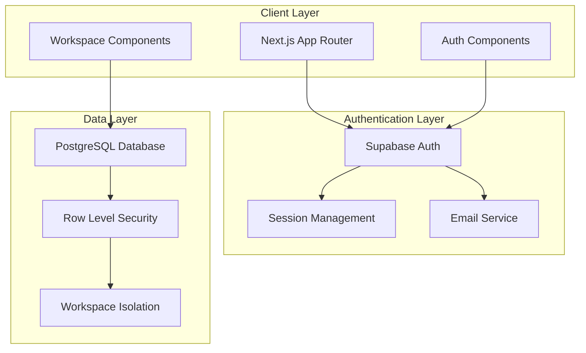

# Design Document: Authentication & Workspace

## Overview

The Authentication & Workspace feature provides the foundational security and collaboration layer for Forma. It implements a multi-tenant architecture where families can create shared workspaces for collaborative financial management while maintaining strict data isolation between different family units.

The design leverages Supabase Auth for user management and PostgreSQL Row Level Security (RLS) for workspace-based data isolation, following modern SaaS multi-tenancy patterns.

## Architecture

### High-Level Architecture



### Multi-Tenant Architecture Pattern

The system implements a **Shared Database, Shared Schema** multi-tenancy pattern with Row Level Security for data isolation:

- **Single Database Instance**: All tenants share the same PostgreSQL database
- **Shared Schema**: All tables are shared across tenants
- **Row-Level Isolation**: RLS policies ensure users only access data from their workspace
- **Tenant Context**: Every request carries workspace context for authorization

## Components and Interfaces

### Authentication Components

#### AuthProvider Context
```typescript
interface AuthContextType {
  user: User | null
  session: Session | null
  loading: boolean
  signIn: (email: string, password: string) => Promise<AuthResult>
  signUp: (email: string, password: string, fullName: string) => Promise<AuthResult>
  signOut: () => Promise<void>
  resetPassword: (email: string) => Promise<AuthResult>
}
```

#### Authentication Forms
- **LoginForm**: Email/password authentication with "remember me" option
- **RegisterForm**: User registration with email verification
- **ResetPasswordForm**: Password reset request and confirmation
- **VerifyEmailForm**: Email verification handling

#### Session Management
- **Middleware**: Refreshes tokens and manages session state
- **AuthGuard**: Protects routes requiring authentication
- **SessionProvider**: Manages client-side session state

### Workspace Components

#### WorkspaceProvider Context
```typescript
interface WorkspaceContextType {
  currentWorkspace: Workspace | null
  workspaces: Workspace[]
  members: WorkspaceMember[]
  invitations: WorkspaceInvitation[]
  loading: boolean
  createWorkspace: (name: string) => Promise<WorkspaceResult>
  switchWorkspace: (workspaceId: string) => Promise<void>
  inviteMember: (email: string) => Promise<InvitationResult>
  removeMember: (memberId: string) => Promise<void>
  transferOwnership: (memberId: string) => Promise<void>
}
```

#### Workspace Management Components
- **WorkspaceSelector**: Dropdown for switching between workspaces
- **WorkspaceSettings**: Manage workspace name and settings
- **MemberManagement**: View, invite, and remove workspace members
- **InvitationManager**: Handle pending invitations
- **OnboardingFlow**: Guide new users through workspace creation

## Data Models

### Core Tables

#### users (Supabase Auth)
```sql
-- Managed by Supabase Auth
-- Extended with custom profile data
CREATE TABLE user_profiles (
  id UUID REFERENCES auth.users(id) PRIMARY KEY,
  full_name TEXT NOT NULL,
  avatar_url TEXT,
  created_at TIMESTAMPTZ DEFAULT NOW(),
  updated_at TIMESTAMPTZ DEFAULT NOW()
);
```

#### workspaces
```sql
CREATE TABLE workspaces (
  id UUID DEFAULT gen_random_uuid() PRIMARY KEY,
  name TEXT NOT NULL,
  owner_id UUID REFERENCES auth.users(id) NOT NULL,
  created_at TIMESTAMPTZ DEFAULT NOW(),
  updated_at TIMESTAMPTZ DEFAULT NOW()
);

-- RLS Policy
CREATE POLICY "Users can view workspaces they belong to" ON workspaces
  FOR SELECT USING (
    owner_id = auth.uid() OR 
    EXISTS (
      SELECT 1 FROM workspace_members 
      WHERE workspace_id = id AND user_id = auth.uid()
    )
  );
```

#### workspace_members
```sql
CREATE TABLE workspace_members (
  id UUID DEFAULT gen_random_uuid() PRIMARY KEY,
  workspace_id UUID REFERENCES workspaces(id) ON DELETE CASCADE,
  user_id UUID REFERENCES auth.users(id) ON DELETE CASCADE,
  role TEXT NOT NULL DEFAULT 'member' CHECK (role IN ('owner', 'member')),
  joined_at TIMESTAMPTZ DEFAULT NOW(),
  UNIQUE(workspace_id, user_id)
);

-- RLS Policy
CREATE POLICY "Users can view members of their workspaces" ON workspace_members
  FOR SELECT USING (
    EXISTS (
      SELECT 1 FROM workspaces w 
      WHERE w.id = workspace_id AND (
        w.owner_id = auth.uid() OR 
        EXISTS (SELECT 1 FROM workspace_members wm WHERE wm.workspace_id = w.id AND wm.user_id = auth.uid())
      )
    )
  );
```

#### workspace_invitations
```sql
CREATE TABLE workspace_invitations (
  id UUID DEFAULT gen_random_uuid() PRIMARY KEY,
  workspace_id UUID REFERENCES workspaces(id) ON DELETE CASCADE,
  email TEXT NOT NULL,
  invited_by UUID REFERENCES auth.users(id) NOT NULL,
  token TEXT NOT NULL UNIQUE,
  expires_at TIMESTAMPTZ NOT NULL,
  accepted_at TIMESTAMPTZ,
  created_at TIMESTAMPTZ DEFAULT NOW(),
  UNIQUE(workspace_id, email)
);
```

### Database Functions

#### Workspace Context Function
```sql
-- Function to get current user's workspace context
CREATE OR REPLACE FUNCTION get_user_workspace_context()
RETURNS TABLE (
  workspace_id UUID,
  role TEXT
) AS $$
BEGIN
  RETURN QUERY
  SELECT wm.workspace_id, wm.role
  FROM workspace_members wm
  WHERE wm.user_id = auth.uid()
  LIMIT 1; -- For now, users have one active workspace
END;
$$ LANGUAGE plpgsql SECURITY DEFINER;
```

#### Auto-assign Owner Role
```sql
-- Trigger to automatically add workspace creator as owner
CREATE OR REPLACE FUNCTION add_workspace_owner()
RETURNS TRIGGER AS $$
BEGIN
  INSERT INTO workspace_members (workspace_id, user_id, role)
  VALUES (NEW.id, NEW.owner_id, 'owner');
  RETURN NEW;
END;
$$ LANGUAGE plpgsql;

CREATE TRIGGER add_workspace_owner_trigger
  AFTER INSERT ON workspaces
  FOR EACH ROW
  EXECUTE FUNCTION add_workspace_owner();
```

## Server Actions

### Authentication Actions

```typescript
// src/actions/auth.ts
export async function signUpAction(formData: FormData): Promise<AuthResult> {
  const supabase = await createClient()
  
  const validated = signUpSchema.safeParse({
    email: formData.get('email'),
    password: formData.get('password'),
    fullName: formData.get('fullName')
  })
  
  if (!validated.success) {
    return { error: validated.error.flatten() }
  }
  
  const { data, error } = await supabase.auth.signUp({
    email: validated.data.email,
    password: validated.data.password,
    options: {
      data: {
        full_name: validated.data.fullName
      }
    }
  })
  
  if (error) {
    return { error: error.message }
  }
  
  return { data: { message: 'Check your email for verification link' } }
}
```

### Workspace Actions

```typescript
// src/actions/workspaces.ts
export async function createWorkspaceAction(formData: FormData): Promise<WorkspaceResult> {
  const supabase = await createClient()
  
  const { data: { user } } = await supabase.auth.getUser()
  if (!user) {
    return { error: 'Authentication required' }
  }
  
  const validated = workspaceSchema.safeParse({
    name: formData.get('name')
  })
  
  if (!validated.success) {
    return { error: validated.error.flatten() }
  }
  
  const { data: workspace, error } = await supabase
    .from('workspaces')
    .insert({
      name: validated.data.name,
      owner_id: user.id
    })
    .select()
    .single()
  
  if (error) {
    return { error: error.message }
  }
  
  // Initialize default categories for the workspace
  await initializeDefaultCategories(workspace.id)
  
  revalidatePath('/dashboard')
  return { data: workspace }
}
```

## Security Implementation

### Row Level Security Policies

All data tables implement RLS policies that enforce workspace-based access control:

```sql
-- Example: transactions table RLS
CREATE POLICY "Users can only access transactions from their workspace" ON transactions
  FOR ALL USING (
    EXISTS (
      SELECT 1 FROM workspace_members wm
      WHERE wm.workspace_id = transactions.workspace_id 
      AND wm.user_id = auth.uid()
    )
  );
```

### Session Security

- **HTTP-only cookies**: Session tokens stored securely
- **Token refresh**: Automatic token refresh via middleware
- **Session validation**: Server-side session validation on protected routes
- **Logout cleanup**: Complete session cleanup on logout

### Rate Limiting

- **Login attempts**: 5 failed attempts trigger 15-minute lockout
- **Password reset**: 3 requests per hour per email
- **Invitation sending**: 10 invitations per hour per workspace

## Error Handling

### Authentication Errors

```typescript
type AuthError = 
  | 'INVALID_CREDENTIALS'
  | 'EMAIL_NOT_VERIFIED'
  | 'ACCOUNT_LOCKED'
  | 'WEAK_PASSWORD'
  | 'EMAIL_ALREADY_EXISTS'
  | 'INVALID_EMAIL_FORMAT'

const AUTH_ERROR_MESSAGES: Record<AuthError, string> = {
  INVALID_CREDENTIALS: 'Invalid email or password',
  EMAIL_NOT_VERIFIED: 'Please verify your email before signing in',
  ACCOUNT_LOCKED: 'Account temporarily locked due to multiple failed attempts',
  WEAK_PASSWORD: 'Password must be at least 8 characters with one number and one letter',
  EMAIL_ALREADY_EXISTS: 'An account with this email already exists',
  INVALID_EMAIL_FORMAT: 'Please enter a valid email address'
}
```

### Workspace Errors

```typescript
type WorkspaceError =
  | 'WORKSPACE_NOT_FOUND'
  | 'INSUFFICIENT_PERMISSIONS'
  | 'MEMBER_ALREADY_EXISTS'
  | 'INVITATION_EXPIRED'
  | 'CANNOT_REMOVE_OWNER'

const WORKSPACE_ERROR_MESSAGES: Record<WorkspaceError, string> = {
  WORKSPACE_NOT_FOUND: 'Workspace not found or access denied',
  INSUFFICIENT_PERMISSIONS: 'You do not have permission to perform this action',
  MEMBER_ALREADY_EXISTS: 'User is already a member of this workspace',
  INVITATION_EXPIRED: 'This invitation has expired',
  CANNOT_REMOVE_OWNER: 'Cannot remove workspace owner'
}
```

## Correctness Properties

*A property is a characteristic or behavior that should hold true across all valid executions of a system-essentially, a formal statement about what the system should do. Properties serve as the bridge between human-readable specifications and machine-verifiable correctness guarantees.*

### Property 1: Password Validation Consistency
*For any* password string, the validation rules (minimum 8 characters, at least one number, one letter) should be consistently applied across registration and password reset flows
**Validates: Requirements 1.3, 3.7**

### Property 2: Email Format and Uniqueness Validation
*For any* email string, the system should validate format correctness and enforce uniqueness across registration, password reset, and invitation flows
**Validates: Requirements 1.4, 3.2, 5.1**

### Property 3: Form Validation Completeness
*For any* form submission with missing required fields, the system should reject the submission and provide appropriate error messages
**Validates: Requirements 1.2, 1.7, 2.1, 4.2**

### Property 4: Access Control for Unverified Users
*For any* unverified user account, the system should prevent access to application features until email verification is completed
**Validates: Requirements 1.6, 4.5, 8.5**

### Property 5: Email Delivery Reliability
*For any* valid user action requiring email notification (registration, password reset, invitation), the system should send the appropriate email within the specified time limit
**Validates: Requirements 1.5, 3.3, 5.2, 8.1, 8.2**

### Property 6: Session Management Security
*For any* user session, the system should maintain session persistence across browser refresh, implement proper logout cleanup, and prevent session restoration after logout
**Validates: Requirements 2.4, 7.2, 7.3**

### Property 7: Authentication Security Consistency
*For any* failed authentication attempt, the system should return generic error messages without revealing whether accounts exist, and implement rate limiting after repeated failures
**Validates: Requirements 2.3, 2.6, 3.4**

### Property 8: Token and Link Expiration
*For any* time-limited token or link (password reset, email verification, workspace invitation), the system should enforce expiration times and prevent reuse of consumed tokens
**Validates: Requirements 3.5, 3.6, 5.4, 8.4**

### Property 9: Workspace Ownership and Membership
*For any* workspace creation, the creator should automatically become the owner, and for any workspace membership change, the system should correctly assign roles and enforce permissions
**Validates: Requirements 4.3, 5.6, 6.1, 6.2, 6.3**

### Property 10: Workspace Data Isolation
*For any* workspace member removal, the removed member should immediately lose access to all workspace data and functionality
**Validates: Requirements 6.4**

### Property 11: Workspace Initialization Consistency
*For any* new workspace creation, the system should initialize the workspace with default categories and proper ownership structure
**Validates: Requirements 4.4**

### Property 12: Invitation Flow Completeness
*For any* workspace invitation, the system should handle both new user registration and existing user joining scenarios correctly
**Validates: Requirements 5.3, 5.5**

### Property 13: Cryptographic Security Standards
*For any* password storage or session token generation, the system should use cryptographically secure methods and proper hashing algorithms
**Validates: Requirements 9.1, 9.2**

### Property 14: Security Event Logging
*For any* authentication error or suspicious activity, the system should log security events without exposing sensitive information and implement appropriate protective measures
**Validates: Requirements 9.4, 9.5**

### Property 15: Session Duration Management
*For any* login with "remember me" option, the session duration should be extended compared to regular sessions
**Validates: Requirements 2.5**

## Testing Strategy

The testing approach combines unit tests for business logic with integration tests for authentication flows and property-based tests for security properties.

### Unit Testing Focus
- Form validation logic
- Error message formatting
- Utility functions (email validation, password strength)
- Component rendering with different states
- Specific UI elements and navigation (login page elements, workspace creation prompts)

### Integration Testing Focus
- Complete authentication flows (register → verify → login)
- Workspace creation and member management
- Session persistence across page refreshes
- RLS policy enforcement
- Email delivery and verification processes

### Property-Based Testing Focus
- Security properties that must hold across all inputs
- Workspace isolation guarantees
- Session management correctness
- Password and email validation consistency
- Token expiration and security behaviors

### Dual Testing Approach
- **Unit tests**: Verify specific examples, edge cases, and error conditions
- **Property tests**: Verify universal properties across all inputs
- Both are complementary and necessary for comprehensive coverage

### Property-Based Testing Configuration
- Minimum 100 iterations per property test
- Each property test must reference its design document property
- Tag format: **Feature: authentication-workspace, Property {number}: {property_text}**