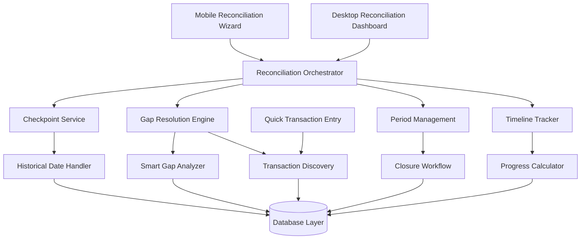

# Enhanced Checkpoint Reconciliation Design

## Overview

This design document outlines the comprehensive enhancement of Forma's checkpoint reconciliation system. The current implementation provides basic checkpoint creation and gap calculation, but lacks the essential **guided workflow** that transforms reconciliation from a confusing technical process into an intuitive, confidence-building financial discipline tool.

The enhanced design focuses on **user experience continuity** - creating a seamless flow from checkpoint creation through gap resolution to period closure, with clear progress indicators and contextual guidance at every step.

## Architecture

### Enhanced System Components



### Enhanced Data Flow

1. **Checkpoint Creation Flow**: User selects date → System validates → Calculates expected balances → Creates checkpoint → Initiates gap analysis
2. **Gap Resolution Flow**: System analyzes gaps → Provides recommendations → User resolves gaps → System recalculates → Enables closure when zero
3. **Period Closure Flow**: User initiates closure → System validates zero gaps → Locks transactions → Triggers pattern learning → Creates next period foundation

## Components and Interfaces

### Enhanced Core Components

#### ReconciliationOrchestrator
```typescript
interface ReconciliationOrchestrator {
  startReconciliation(workspaceId: string, selectedDate?: Date): Promise<ReconciliationSession>
  continueReconciliation(sessionId: string): Promise<ReconciliationSession>
  getReconciliationProgress(sessionId: string): Promise<ReconciliationProgress>
  completeReconciliation(sessionId: string): Promise<CompletedReconciliation>
}
```

#### HistoricalCheckpointService
```typescript
interface HistoricalCheckpointService {
  validateHistoricalDate(date: Date, workspaceId: string): Promise<DateValidationResult>
  calculateHistoricalExpectedBalances(date: Date, accountIds: string[]): Promise<AccountBalance[]>
  createHistoricalCheckpoint(data: HistoricalCheckpointData): Promise<Checkpoint>
}
```

#### SmartGapAnalyzer
```typescript
interface SmartGapAnalyzer {
  analyzeGaps(gaps: ReconciliationGap[], periodTransactions: Transaction[]): Promise<GapAnalysis>
  generateRecommendations(analysis: GapAnalysis): Promise<GapRecommendation[]>
  identifyLikelyMissingTransactions(gap: ReconciliationGap): Promise<TransactionSuggestion[]>
}
```

#### ReconciliationTimeline
```typescript
interface ReconciliationTimeline {
  getCurrentStep(sessionId: string): Promise<ReconciliationStep>
  getProgressPercentage(sessionId: string): Promise<number>
  getNextSteps(sessionId: string): Promise<NextStep[]>
  markStepComplete(sessionId: string, step: ReconciliationStep): Promise<void>
}
```

### Enhanced UI Components

#### ReconciliationWizard (Mobile-First)
```typescript
interface ReconciliationWizardProps {
  workspaceId: string
  initialStep?: ReconciliationStep
  onComplete: (result: CompletedReconciliation) => void
  onCancel: () => void
}
```

#### GapResolutionGuide
```typescript
interface GapResolutionGuideProps {
  gaps: ReconciliationGap[]
  recommendations: GapRecommendation[]
  onGapResolved: (gapId: string, resolution: GapResolution) => void
  onAllGapsResolved: () => void
}
```

#### QuickTransactionEntry
```typescript
interface QuickTransactionEntryProps {
  accountId: string
  suggestedAmount?: number
  suggestedType?: 'income' | 'expense'
  reconciliationPeriod: DateRange
  onTransactionAdded: (transaction: Transaction) => void
}
```

## Data Models

### Enhanced Data Models

#### ReconciliationSession
```typescript
interface ReconciliationSession {
  id: string
  workspace_id: string
  checkpoint_id: string
  current_step: ReconciliationStep
  progress_percentage: number
  gaps_remaining: number
  started_at: Date
  last_activity_at: Date
  status: 'active' | 'paused' | 'completed' | 'abandoned'
  metadata: ReconciliationMetadata
}
```

#### HistoricalCheckpoint
```typescript
interface HistoricalCheckpoint extends Checkpoint {
  selected_date: Date // User-selected date (can be in the past)
  is_historical: boolean
  baseline_established: boolean
  historical_validation: HistoricalValidation
}
```

#### GapAnalysis
```typescript
interface GapAnalysis {
  gap_id: string
  severity: 'low' | 'medium' | 'high'
  likely_causes: string[]
  confidence_score: number
  recommended_actions: RecommendedAction[]
  similar_patterns: SimilarPattern[]
  estimated_resolution_time: number
}
```

#### ReconciliationProgress
```typescript
interface ReconciliationProgress {
  session_id: string
  current_step: ReconciliationStep
  completed_steps: ReconciliationStep[]
  remaining_steps: ReconciliationStep[]
  progress_percentage: number
  estimated_completion_time: number
  gaps_summary: GapsSummary
  next_actions: NextAction[]
}
```

#### GapRecommendation
```typescript
interface GapRecommendation {
  gap_id: string
  recommendation_type: 'quick_close' | 'add_transaction' | 'review_period' | 'split_resolution'
  confidence: number
  reasoning: string
  suggested_actions: SuggestedAction[]
  estimated_effort: 'low' | 'medium' | 'high'
}
```

### Enhanced Enums

```typescript
enum ReconciliationStep {
  CHECKPOINT_CREATION = 'checkpoint_creation',
  GAP_ANALYSIS = 'gap_analysis',
  GAP_RESOLUTION = 'gap_resolution',
  TRANSACTION_REVIEW = 'transaction_review',
  FINAL_VALIDATION = 'final_validation',
  PERIOD_CLOSURE = 'period_closure',
  COMPLETION = 'completion'
}

enum GapResolutionMethod {
  QUICK_CLOSE = 'quick_close',
  ADD_MISSING_TRANSACTION = 'add_missing_transaction',
  SPLIT_RESOLUTION = 'split_resolution',
  MANUAL_ADJUSTMENT = 'manual_adjustment'
}
```

## User Experience Design

### Reconciliation Wizard Flow (Mobile-First)

#### Step 1: Checkpoint Creation
- **Header**: "Create Checkpoint" with progress indicator (1/6)
- **Date Selector**: Prominent date picker with "Today" default and historical date option
- **Account Balances**: Large, touch-friendly input fields with currency formatting
- **Visual Feedback**: Real-time gap calculation as balances are entered
- **Navigation**: "Continue" button enabled when at least one balance entered

#### Step 2: Gap Analysis
- **Header**: "Analyzing Differences" with progress indicator (2/6)
- **Gap Summary**: Visual representation of gaps with severity colors
- **Smart Insights**: AI-generated explanations for likely gap causes
- **Recommendations**: Prioritized list of suggested resolution methods
- **Navigation**: "Start Resolving" button to proceed to resolution

#### Step 3: Gap Resolution
- **Header**: "Resolve Gaps" with progress indicator (3/6)
- **Account Selector**: Swipeable cards for multi-account scenarios
- **Resolution Options**: Clear choice between Quick Close and Add Transaction
- **Progress Tracking**: "X of Y gaps resolved" with visual progress bar
- **Navigation**: "Next Gap" or "Review Resolution" when current gap resolved

#### Step 4: Transaction Review
- **Header**: "Review Period" with progress indicator (4/6)
- **Transaction List**: Scrollable list with new transactions highlighted
- **Add Missing**: Prominent button for additional transaction discovery
- **Validation**: Real-time gap recalculation as transactions are added
- **Navigation**: "Finalize" button when user confirms completeness

#### Step 5: Final Validation
- **Header**: "Final Check" with progress indicator (5/6)
- **Zero Gap Confirmation**: Clear display that all gaps are resolved
- **Period Summary**: Key statistics and changes made during reconciliation
- **Lock Warning**: Clear explanation of transaction locking upon closure
- **Navigation**: "Close Period" button with confirmation dialog

#### Step 6: Completion
- **Header**: "Reconciliation Complete!" with progress indicator (6/6)
- **Success Celebration**: Positive reinforcement with key achievements
- **Next Steps**: Recommendations for ongoing financial discipline
- **Actions**: Options to view history, export report, or start next period
- **Navigation**: "Done" button to return to dashboard

### Desktop Dashboard Integration

#### Reconciliation Status Widget
- **Current Status**: Large, prominent display of reconciliation health
- **Days Since Checkpoint**: Prominent counter with trend indicator
- **Gap Summary**: Visual representation of any existing gaps
- **Quick Actions**: One-click access to start reconciliation or resolve gaps
- **Progress Indicator**: If reconciliation in progress, show current step

#### Reconciliation History Panel
- **Timeline View**: Visual timeline of completed reconciliation periods
- **Period Cards**: Expandable cards showing period details and statistics
- **Trend Analysis**: Charts showing reconciliation frequency and accuracy over time
- **Export Options**: Quick access to generate reconciliation reports

## Enhanced Algorithms

### Smart Gap Analysis Algorithm

```typescript
class SmartGapAnalyzer {
  async analyzeGap(gap: ReconciliationGap, context: AnalysisContext): Promise<GapAnalysis> {
    const analysis: GapAnalysis = {
      gap_id: gap.gap_id,
      severity: this.calculateSeverity(gap, context),
      likely_causes: [],
      confidence_score: 0,
      recommended_actions: [],
      similar_patterns: [],
      estimated_resolution_time: 0
    }

    // Analyze gap size relative to period activity
    if (Math.abs(gap.gap_amount) < context.periodTotal * 0.02) {
      analysis.likely_causes.push('Small rounding differences or minor untracked expenses')
      analysis.recommended_actions.push({
        type: 'quick_close',
        priority: 'high',
        reasoning: 'Gap is small relative to period activity'
      })
      analysis.confidence_score = 0.8
      analysis.estimated_resolution_time = 30 // seconds
    }

    // Check for common transaction amounts
    const commonAmounts = this.getCommonTransactionAmounts(context.historicalTransactions)
    const matchingAmount = commonAmounts.find(amount => 
      Math.abs(Math.abs(gap.gap_amount) - amount.amount) < 0.01
    )
    
    if (matchingAmount) {
      analysis.likely_causes.push(`Missing ${matchingAmount.description} transaction`)
      analysis.recommended_actions.push({
        type: 'add_transaction',
        priority: 'high',
        reasoning: `Gap amount matches common ${matchingAmount.category} transactions`,
        suggested_transaction: {
          amount: Math.abs(gap.gap_amount),
          type: gap.gap_amount > 0 ? 'income' : 'expense',
          category: matchingAmount.category,
          description: matchingAmount.description
        }
      })
      analysis.confidence_score = 0.9
      analysis.estimated_resolution_time = 120 // seconds
    }

    // Pattern matching against historical reconciliations
    const similarPatterns = await this.findSimilarHistoricalPatterns(gap, context)
    analysis.similar_patterns = similarPatterns
    
    if (similarPatterns.length > 0) {
      const mostCommonResolution = this.getMostCommonResolution(similarPatterns)
      analysis.recommended_actions.unshift({
        type: mostCommonResolution.method,
        priority: 'medium',
        reasoning: `Similar gaps were typically resolved by ${mostCommonResolution.description}`
      })
    }

    return analysis
  }

  private calculateSeverity(gap: ReconciliationGap, context: AnalysisContext): 'low' | 'medium' | 'high' {
    const percentage = Math.abs(gap.gap_amount) / Math.abs(context.periodTotal) * 100
    
    if (percentage < 2) return 'low'
    if (percentage < 5) return 'medium'
    return 'high'
  }
}
```

### Historical Date Validation Algorithm

```typescript
class HistoricalDateValidator {
  async validateHistoricalDate(date: Date, workspaceId: string): Promise<DateValidationResult> {
    const result: DateValidationResult = {
      isValid: true,
      warnings: [],
      errors: [],
      recommendations: []
    }

    // Check if date is in the future
    if (date > new Date()) {
      result.isValid = false
      result.errors.push('Cannot create checkpoint for future date')
      return result
    }

    // Check if date is too far in the past (more than 2 years)
    const twoYearsAgo = new Date()
    twoYearsAgo.setFullYear(twoYearsAgo.getFullYear() - 2)
    
    if (date < twoYearsAgo) {
      result.warnings.push('Creating checkpoint more than 2 years in the past may affect accuracy')
      result.recommendations.push('Consider starting with a more recent date for better transaction coverage')
    }

    // Check for existing checkpoints after this date
    const laterCheckpoints = await this.getCheckpointsAfterDate(date, workspaceId)
    if (laterCheckpoints.length > 0) {
      result.isValid = false
      result.errors.push(`Cannot create checkpoint before existing checkpoint on ${laterCheckpoints[0].created_at}`)
      return result
    }

    // Check transaction coverage for the period
    const transactionCoverage = await this.analyzeTransactionCoverage(date, workspaceId)
    if (transactionCoverage.percentage < 0.8) {
      result.warnings.push(`Limited transaction data available (${Math.round(transactionCoverage.percentage * 100)}% coverage)`)
      result.recommendations.push('Consider adding missing transactions for the period to improve accuracy')
    }

    return result
  }
}
```

## Mobile Optimization Strategy

### Progressive Enhancement Approach

1. **Mobile-First Design**: All reconciliation flows designed for mobile, enhanced for desktop
2. **Touch-Optimized Interactions**: Large buttons, swipe gestures, haptic feedback
3. **Simplified Navigation**: Linear wizard flow with clear progress indicators
4. **Offline Capability**: Core reconciliation functions work offline with sync when connected
5. **Performance Optimization**: Lazy loading, efficient rendering, minimal data transfer

### Mobile-Specific Features

#### Swipe Navigation
- Swipe between accounts during gap resolution
- Swipe through reconciliation steps
- Swipe to dismiss completed items

#### Camera Integration
- Scan receipts to quickly add missing transactions
- OCR text extraction for transaction details
- Photo attachment for transaction records

#### Haptic Feedback
- Success vibration when gaps are resolved
- Warning vibration for validation errors
- Completion celebration with haptic pattern

## Error Handling and Recovery

### Graceful Degradation Patterns

#### Network Connectivity Issues
- **Offline Mode**: Allow reconciliation to continue with local storage
- **Sync Recovery**: Automatic sync when connection restored
- **Conflict Resolution**: Smart merging of offline and online changes

#### Data Validation Errors
- **Real-time Validation**: Immediate feedback on invalid inputs
- **Contextual Help**: Specific guidance for each validation error
- **Auto-correction**: Suggest corrections for common input mistakes

#### Process Interruption Recovery
- **Session Persistence**: Save reconciliation progress automatically
- **Resume Capability**: Allow users to resume interrupted reconciliation
- **State Recovery**: Restore exact state when returning to reconciliation

## Testing Strategy

### Enhanced Testing Approach

**Unit Tests** focus on:
- Historical date validation logic
- Smart gap analysis algorithms
- Progress calculation accuracy
- Mobile-specific interaction handlers

**Property-Based Tests** focus on:
- Gap resolution workflow completeness
- Timeline progress consistency
- Multi-account reconciliation independence
- Historical checkpoint date handling

**Integration Tests** focus on:
- End-to-end reconciliation workflow
- Mobile wizard flow completion
- Cross-device session continuity
- Database consistency during complex workflows

**User Experience Tests** focus on:
- Mobile usability testing
- Reconciliation completion rates
- User confidence measurements
- Time-to-completion metrics

This enhanced design transforms reconciliation from a technical feature into an intuitive, confidence-building financial discipline tool that users will actually want to use regularly.