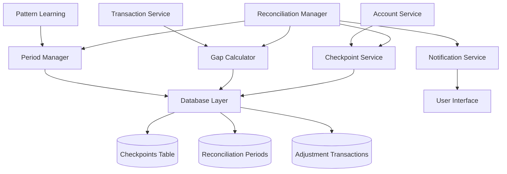

# Design Document

## Overview

The Checkpoint Reconciliation system is the cornerstone of Forma's unique approach to personal finance management. Unlike traditional expense trackers that rely on continuous monitoring, this system implements a periodic verification workflow where users create checkpoints by entering actual account balances and reconciling them against expected balances calculated from transaction records.

This design transforms financial management from a reactive process into a proactive discipline, ensuring users maintain accurate records while providing the foundation for Forma's pattern learning and forecasting capabilities. The system emphasizes simplicity, visual clarity, and mobile-first interactions to make reconciliation feel effortless rather than burdensome.

## Architecture

### System Components



### Data Flow

1. **Checkpoint Creation**: User enters actual balances → System calculates expected balances → Gap analysis performed
2. **Gap Resolution**: User reviews transactions → Adds missing transactions or creates adjustments → Gap resolved to zero
3. **Period Closure**: Gap verified as zero → Transactions locked → Pattern learning triggered → Period archived

## Components and Interfaces

### Core Components

#### CheckpointManager
```typescript
interface CheckpointManager {
  createCheckpoint(accountBalances: AccountBalance[]): Promise<Checkpoint>
  calculateExpectedBalance(accountId: string, fromDate: Date): Promise<number>
  getReconciliationStatus(): Promise<ReconciliationStatus>
  resolveGap(resolution: GapResolution): Promise<void>
  closePeriod(periodId: string): Promise<ClosedPeriod>
}
```

#### GapCalculator
```typescript
interface GapCalculator {
  calculateGap(expected: number, actual: number): ReconciliationGap
  analyzeGapSeverity(gap: ReconciliationGap, periodTransactions: Transaction[]): GapSeverity
  generateAdjustmentTransaction(gap: ReconciliationGap): Transaction
}
```

#### ReconciliationUI
```typescript
interface ReconciliationUI {
  renderCheckpointCreation(): React.Component
  renderReconciliationStatus(): React.Component
  renderGapResolution(): React.Component
  renderPeriodClosure(): React.Component
  renderReconciliationHistory(): React.Component
}
```

### Mobile-First Interface Design

#### Checkpoint Creation Flow
- **Step 1**: Single-screen balance entry with account cards
- **Step 2**: Automatic gap calculation with visual indicators
- **Step 3**: Gap resolution options with clear CTAs
- **Step 4**: Confirmation with period summary

#### Visual Hierarchy
- **Primary Action**: Large, prominent "Create Checkpoint" button
- **Status Indicators**: Color-coded gap severity (green/yellow/red)
- **Progress Tracking**: Days since last checkpoint prominently displayed
- **Quick Actions**: One-tap gap resolution options

## Data Models

### Checkpoint
```typescript
interface Checkpoint {
  id: string
  workspace_id: string
  created_at: Date
  created_by: string
  account_balances: AccountBalance[]
  expected_balances: AccountBalance[]
  gaps: ReconciliationGap[]
  status: 'open' | 'resolved' | 'closed'
  notes?: string
}
```

### AccountBalance
```typescript
interface AccountBalance {
  account_id: string
  account_name: string
  actual_balance: number
  expected_balance: number
  currency: string
  gap_amount: number
  gap_percentage: number
}
```

### ReconciliationGap
```typescript
interface ReconciliationGap {
  account_id: string
  gap_amount: number
  gap_percentage: number
  severity: 'low' | 'medium' | 'high'
  resolution_method?: 'manual_transaction' | 'quick_close'
  adjustment_transaction_id?: string
}
```

### ReconciliationPeriod
```typescript
interface ReconciliationPeriod {
  id: string
  workspace_id: string
  start_checkpoint_id: string
  end_checkpoint_id?: string
  start_date: Date
  end_date?: Date
  status: 'active' | 'closed'
  total_transactions: number
  total_amount: number
  pattern_learning_completed: boolean
  locked_transactions: string[]
}
```

### ReconciliationStatus
```typescript
interface ReconciliationStatus {
  current_period: ReconciliationPeriod
  days_since_last_checkpoint: number
  total_gap_amount: number
  total_gap_percentage: number
  gap_severity: 'low' | 'medium' | 'high'
  accounts_with_gaps: AccountBalance[]
  reminder_level: 'none' | 'warning' | 'urgent'
}
```

## Correctness Properties

*A property is a characteristic or behavior that should hold true across all valid executions of a system-essentially, a formal statement about what the system should do. Properties serve as the bridge between human-readable specifications and machine-verifiable correctness guarantees.*

### Property Reflection

After analyzing all acceptance criteria, I identified several areas where properties can be consolidated to eliminate redundancy:

- **Gap Severity Properties (2.3, 2.4, 2.5)**: These can be combined into a single comprehensive property about gap severity calculation and visual indicators
- **Notification Properties (5.2, 5.3)**: These can be combined into one property about notification thresholds
- **Adjustment Transaction Properties (3.4, 3.5)**: These can be combined into one property about adjustment transaction type determination
- **Multi-account Properties (7.1, 7.2, 7.3)**: These can be consolidated into properties about account-specific calculations and displays

### Core Properties

**Property 1: Account Balance Prompting**
*For any* set of tracked accounts, when creating a checkpoint, the system should prompt the user to enter actual balances for each account separately
**Validates: Requirements 1.2, 7.1**

**Property 2: Automatic Timestamp Recording**
*For any* checkpoint creation, the recorded timestamp should be within a reasonable range (±1 minute) of the actual creation time
**Validates: Requirements 1.3**

**Property 3: Expected Balance Calculation**
*For any* checkpoint, the expected balance should equal the previous checkpoint balance plus the sum of all transactions since the previous checkpoint
**Validates: Requirements 1.4, 7.2**

**Property 4: Gap Calculation and Display**
*For any* difference between expected and actual balances, the system should correctly calculate and display both absolute amount and percentage difference
**Validates: Requirements 1.5, 2.2**

**Property 5: Checkpoint Persistence**
*For any* saved checkpoint, it should be retrievable from the checkpoint history with all original data intact
**Validates: Requirements 1.6**

**Property 6: Reconciliation Status Completeness**
*For any* reconciliation status view, it should contain last checkpoint date, expected balance, gap amount, and days since last checkpoint
**Validates: Requirements 2.1, 2.6**

**Property 7: Gap Severity Indicators**
*For any* reconciliation gap, the visual indicator should be green if gap < 2% of period transactions, yellow if 2-5%, and red if > 5%
**Validates: Requirements 2.3, 2.4, 2.5**

**Property 8: Period Transaction Filtering**
*For any* reconciliation period, the system should show all and only the transactions that occurred within that period's date range
**Validates: Requirements 3.1**

**Property 9: Transaction Addition During Reconciliation**
*For any* transaction added during reconciliation, it should be immediately included in the gap calculation for the current period
**Validates: Requirements 3.2**

**Property 10: Quick Close Adjustment Creation**
*For any* quick close operation, the system should create exactly one adjustment transaction in the "Other" category with an amount equal to the gap
**Validates: Requirements 3.3**

**Property 11: Adjustment Transaction Type Determination**
*For any* reconciliation gap, negative gaps (actual < expected) should create "Other Expense" transactions and positive gaps (actual > expected) should create "Other Income" transactions
**Validates: Requirements 3.4, 3.5**

**Property 12: Gap Resolution State Change**
*For any* completed gap resolution, the displayed gap should be zero and period closure should be enabled
**Validates: Requirements 3.6**

**Property 13: Zero Gap Closure Constraint**
*For any* reconciliation period, closure should only be possible when all account gaps equal zero
**Validates: Requirements 4.1, 7.5**

**Property 14: Transaction Locking on Closure**
*For any* closed reconciliation period, all transactions within that period should be locked from editing unless explicitly unlocked
**Validates: Requirements 4.2**

**Property 15: Pattern Learning Trigger**
*For any* reconciliation period closure, the pattern learning algorithm should be triggered exactly once
**Validates: Requirements 4.3**

**Property 16: Period Archival**
*For any* closed reconciliation period, it should be added to the reconciliation history with a complete summary of the period's financial activity
**Validates: Requirements 4.5**

**Property 17: Days Since Checkpoint Calculation**
*For any* checkpoint date, the calculated days since checkpoint should equal the actual number of calendar days between the checkpoint date and current date
**Validates: Requirements 5.1**

**Property 18: Notification Threshold Triggering**
*For any* workspace owner, warning notifications should appear at exactly 7 days without reconciliation and urgent notifications at exactly 14 days
**Validates: Requirements 5.2, 5.3**

**Property 19: Workspace Owner Notification Targeting**
*For any* reconciliation reminder, notifications should be sent only to workspace owners and not to other workspace members
**Validates: Requirements 5.4**

**Property 20: Chronological History Ordering**
*For any* reconciliation history display, all completed checkpoints should be ordered chronologically from most recent to oldest
**Validates: Requirements 6.1**

**Property 21: History Data Completeness**
*For any* checkpoint in history, the display should include checkpoint date, actual balance, expected balance, gap amount, and resolution method
**Validates: Requirements 6.2**

**Property 22: Adjustment Transaction Indication**
*For any* reconciliation period closed with adjustments, the history should clearly indicate which adjustment transactions were created
**Validates: Requirements 6.3**

**Property 23: Historical Period Drill-down**
*For any* historical reconciliation period, users should be able to access all transactions that comprised that period
**Validates: Requirements 6.4**

**Property 24: Reconciliation Metrics Calculation**
*For any* set of historical reconciliation data, calculated metrics (average gap size, reconciliation frequency, accuracy trends) should accurately reflect the underlying data
**Validates: Requirements 6.5**

**Property 25: Multi-Account Gap Display**
*For any* multi-account reconciliation, the system should display individual account gaps and a correctly calculated total consolidated gap
**Validates: Requirements 7.3**

**Property 26: Independent Account Gap Resolution**
*For any* multi-account reconciliation, each account's gap should be resolvable independently without affecting other accounts' gaps
**Validates: Requirements 7.4**

## Error Handling

### Gap Calculation Errors
- **Invalid Balance Input**: Reject non-numeric or negative balance entries with clear error messages
- **Missing Previous Checkpoint**: Handle first checkpoint creation gracefully by using zero as starting balance
- **Transaction Date Conflicts**: Resolve transactions that span checkpoint boundaries using transaction timestamp

### Period Management Errors
- **Concurrent Checkpoint Creation**: Prevent multiple users from creating checkpoints simultaneously
- **Period Closure Conflicts**: Ensure only one period can be active at a time per workspace
- **Transaction Lock Violations**: Prevent editing of locked transactions with informative error messages

### Data Consistency Errors
- **Account Deletion**: Handle cases where tracked accounts are deleted mid-period
- **Currency Conversion**: Manage multi-currency scenarios with appropriate exchange rate handling
- **Timezone Issues**: Ensure consistent date handling across different user timezones

## Testing Strategy

### Dual Testing Approach
The reconciliation system requires both unit tests and property-based tests to ensure comprehensive coverage:

**Unit Tests** focus on:
- Specific checkpoint creation scenarios
- Gap calculation edge cases (zero gaps, large gaps, currency precision)
- UI component rendering and interaction
- Error handling for invalid inputs
- Integration between reconciliation and transaction systems

**Property-Based Tests** focus on:
- Universal properties that hold across all reconciliation scenarios
- Mathematical correctness of gap calculations and expected balance formulas
- State consistency throughout the reconciliation workflow
- Multi-account reconciliation behavior across different account combinations
- Notification timing accuracy across various checkpoint intervals

### Property Test Configuration
- **Testing Framework**: fast-check for TypeScript property-based testing
- **Test Iterations**: Minimum 100 iterations per property test
- **Test Tags**: Each property test tagged with format: **Feature: checkpoint-reconciliation, Property {number}: {property_text}**
- **Coverage Requirements**: All 26 correctness properties must be implemented as property-based tests

### Integration Testing
- **Database Consistency**: Verify checkpoint data persists correctly across system restarts
- **Transaction Integration**: Ensure reconciliation works seamlessly with transaction creation/editing
- **Multi-User Scenarios**: Test reconciliation behavior in shared workspaces
- **Performance Testing**: Validate reconciliation performance with large transaction volumes

The testing strategy ensures both specific scenarios work correctly (unit tests) and universal behaviors hold across all possible inputs (property tests), providing comprehensive validation of the reconciliation system's correctness.

<function_calls>
<invoke name="prework">
<parameter name="featureName">checkpoint-reconciliation