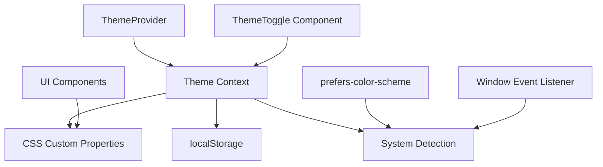

# Design Document

## Overview

This document outlines the technical design for implementing a comprehensive theme switching system in the Forma application. The system will provide seamless transitions between light mode ("Day Studio"), dark mode ("Night Cockpit"), and system preference detection while maintaining the Executive Lounge aesthetic across all themes.

## Architecture

### Theme System Architecture



The theme system follows a centralized architecture where:
- **ThemeProvider** manages global theme state
- **Theme Context** provides theme data to all components
- **CSS Custom Properties** handle visual styling updates
- **localStorage** persists user preferences
- **System Detection** monitors OS theme changes

## Components and Interfaces

### 1. Theme Context and Provider

```typescript
// src/contexts/theme-context.tsx

export type ThemeMode = 'light' | 'dark' | 'system'
export type ResolvedTheme = 'light' | 'dark'

interface ThemeContextType {
  theme: ThemeMode
  resolvedTheme: ResolvedTheme
  setTheme: (theme: ThemeMode) => void
  systemTheme: ResolvedTheme
}

interface ThemeProviderProps {
  children: React.ReactNode
  defaultTheme?: ThemeMode
  storageKey?: string
}

export function ThemeProvider({ 
  children, 
  defaultTheme = 'system',
  storageKey = 'forma-theme' 
}: ThemeProviderProps)

export function useTheme(): ThemeContextType
```

### 2. Theme Toggle Component

```typescript
// src/components/shared/theme-toggle.tsx

interface ThemeToggleProps {
  className?: string
  showLabels?: boolean
}

export function ThemeToggle({ 
  className, 
  showLabels = true 
}: ThemeToggleProps)
```

### 3. Theme Detection Hook

```typescript
// src/hooks/use-system-theme.ts

export function useSystemTheme(): ResolvedTheme
```

## Data Models

### Theme Configuration

```typescript
interface ThemeConfig {
  colors: {
    background: {
      primary: string
      secondary: string
      glass: string
    }
    text: {
      primary: string
      secondary: string
    }
    accent: {
      primary: string
      secondary: string
    }
    success: string
    warning: string
    error: string
  }
  effects: {
    ambientGlow: string
    glassBorder: string
    shadow: string
  }
}

const lightTheme: ThemeConfig = {
  colors: {
    background: {
      primary: '#F5F5F4',      // Warm Alabaster
      secondary: '#E7E5E4',    // Latte Leather
      glass: '#FFFFFF'         // Pure White
    },
    text: {
      primary: '#1C1917',      // Ink Grey
      secondary: 'rgba(28, 25, 23, 0.6)'
    },
    accent: {
      primary: '#B45309',      // Burnt Copper
      secondary: '#92400E'     // Darker Copper
    },
    success: '#166534',        // Dark Green for light mode
    warning: '#A16207',        // Dark Amber
    error: '#DC2626'          // Red
  },
  effects: {
    ambientGlow: 'rgba(180, 83, 9, 0.1)',
    glassBorder: 'rgba(28, 25, 23, 0.1)',
    shadow: 'rgba(180, 83, 9, 0.2)'
  }
}

const darkTheme: ThemeConfig = {
  colors: {
    background: {
      primary: '#1C1917',      // Peat Charcoal
      secondary: '#2A1D15',    // Deep Leather
      glass: 'rgba(255, 255, 255, 0.04)'
    },
    text: {
      primary: 'rgba(255, 255, 255, 0.9)',
      secondary: 'rgba(255, 255, 255, 0.6)'
    },
    accent: {
      primary: '#E6A65D',      // Single Malt
      secondary: '#5C3A21'     // Aged Oak
    },
    success: '#4E7A58',        // Growth Emerald
    warning: '#D97706',        // Amber
    error: '#EF4444'          // Light Red
  },
  effects: {
    ambientGlow: 'rgba(230, 166, 93, 0.15)',
    glassBorder: 'rgba(255, 255, 255, 0.08)',
    shadow: 'rgba(230, 166, 93, 0.4)'
  }
}
```

## Correctness Properties

*A property is a characteristic or behavior that should hold true across all valid executions of a system-essentially, a formal statement about what the system should do. Properties serve as the bridge between human-readable specifications and machine-verifiable correctness guarantees.*

Let me first analyze the acceptance criteria to determine which ones are testable as properties.

<function_calls>
<invoke name="prework">
<parameter name="featureName">theme-switching

After analyzing the acceptance criteria, I can identify several properties that can be consolidated for more effective testing:

**Property Reflection:**
- Properties 3.1-3.5 and 4.1-4.5 (individual color testing) can be combined into comprehensive theme color validation properties
- Properties 5.1-5.4 (individual component adaptation) can be combined into a single component adaptation property
- Properties 6.1-6.4 (contrast ratios) can be combined into accessibility compliance properties
- Properties 8.1-8.5 (localStorage operations) can be combined into persistence behavior properties

### Property 1: Theme State Management
*For any* theme mode ('light', 'dark', 'system'), the Theme_System should correctly manage state transitions and provide the expected interface through React context
**Validates: Requirements 1.1, 1.5**

### Property 2: Theme Persistence Round Trip
*For any* valid theme selection, storing the theme in localStorage and then retrieving it should produce the same theme value
**Validates: Requirements 1.2, 8.1, 8.2**

### Property 3: System Theme Detection
*For any* system color scheme preference, the Theme_System should correctly detect and apply the corresponding theme when in 'system' mode
**Validates: Requirements 1.3, 7.1, 7.3, 7.4**

### Property 4: CSS Custom Properties Update
*For any* theme change, all CSS custom properties should be updated to match the new theme's color configuration
**Validates: Requirements 1.4, 10.1**

### Property 5: Theme Toggle Interaction
*For any* theme option selection in the Theme_Toggle, the theme should immediately update and be visually indicated as active
**Validates: Requirements 2.3, 2.5**

### Property 6: Light Mode Color Consistency
*For any* component in light mode, the applied colors should match the defined light theme color palette (Warm Alabaster, Latte Leather, Pure White, Burnt Copper, Ink Grey)
**Validates: Requirements 3.1, 3.2, 3.3, 3.4, 3.5**

### Property 7: Dark Mode Color Consistency
*For any* component in dark mode, the applied colors should match the defined dark theme color palette (Peat Charcoal, Deep Leather, translucent white, Single Malt, high-contrast white)
**Validates: Requirements 4.1, 4.2, 4.3, 4.4, 4.5, 4.6**

### Property 8: Component Theme Adaptation
*For any* theme change, all UI components (glass cards, buttons, form inputs, navigation) should update their styles to match the new theme
**Validates: Requirements 5.1, 5.2, 5.3, 5.4, 5.5**

### Property 9: Accessibility Contrast Compliance
*For any* theme and text element combination, the contrast ratio should meet WCAG guidelines (4.5:1 for normal text, 3:1 for large text/UI elements)
**Validates: Requirements 6.1, 6.2, 6.3, 6.4**

### Property 10: System Theme Reactivity
*For any* system color scheme change event, the Theme_System should automatically update the application theme when in 'system' mode
**Validates: Requirements 7.2, 7.5**

### Property 11: Persistence Error Handling
*For any* localStorage error or invalid theme value, the Theme_System should gracefully fallback to system theme detection
**Validates: Requirements 8.3, 8.4, 8.5**

### Property 12: Smooth Theme Transitions
*For any* theme change, the visual transition should complete within 300ms using CSS transitions without causing layout shifts
**Validates: Requirements 9.1, 9.2, 9.3, 9.4**

### Property 13: Reduced Motion Accessibility
*For any* user with prefers-reduced-motion enabled, theme transitions should be disabled or significantly reduced
**Validates: Requirements 9.5**

### Property 14: Design System Integration
*For any* existing UI component, it should maintain its visual aesthetic and functionality in both light and dark themes
**Validates: Requirements 10.2, 10.3, 10.4, 10.5**

## Error Handling

### Theme Detection Errors
```typescript
// Graceful fallback when system detection fails
function getSystemTheme(): ResolvedTheme {
  try {
    if (typeof window !== 'undefined' && window.matchMedia) {
      return window.matchMedia('(prefers-color-scheme: dark)').matches ? 'dark' : 'light'
    }
  } catch (error) {
    console.warn('System theme detection failed:', error)
  }
  return 'dark' // Default fallback
}
```

### localStorage Errors
```typescript
// Robust localStorage handling
function getStoredTheme(key: string): ThemeMode | null {
  try {
    if (typeof window !== 'undefined') {
      const stored = localStorage.getItem(key)
      if (stored && ['light', 'dark', 'system'].includes(stored)) {
        return stored as ThemeMode
      }
    }
  } catch (error) {
    console.warn('Failed to read theme from localStorage:', error)
  }
  return null
}

function setStoredTheme(key: string, theme: ThemeMode): void {
  try {
    if (typeof window !== 'undefined') {
      localStorage.setItem(key, theme)
    }
  } catch (error) {
    console.warn('Failed to save theme to localStorage:', error)
  }
}
```

### CSS Custom Properties Fallback
```css
/* Fallback values for CSS custom properties */
:root {
  --bg-primary: #1C1917; /* Default to dark theme */
  --bg-secondary: #2A1D15;
  --bg-glass: rgba(255, 255, 255, 0.04);
  --text-primary: rgba(255, 255, 255, 0.9);
  --text-secondary: rgba(255, 255, 255, 0.6);
  --accent-primary: #E6A65D;
  --accent-secondary: #5C3A21;
  --success: #4E7A58;
}
```

## Testing Strategy

### Unit Testing Approach
- **Theme Context**: Test state management, theme switching, and persistence
- **Theme Toggle**: Test user interactions and visual state updates
- **System Detection**: Test media query handling and event listeners
- **CSS Updates**: Test that custom properties are correctly applied

### Property-Based Testing Approach
- **Theme Consistency**: Generate random theme configurations and verify color consistency
- **Persistence Round Trip**: Test localStorage operations with various theme values
- **System Integration**: Mock different system preferences and verify correct detection
- **Accessibility**: Test contrast ratios across all theme/component combinations
- **Error Handling**: Test graceful fallbacks with simulated errors

### Integration Testing
- **Component Adaptation**: Test that existing components work correctly with both themes
- **Settings Integration**: Test theme toggle placement and functionality in settings page
- **Performance**: Test that theme switching completes within performance requirements

### Property Test Configuration
- Minimum 100 iterations per property test
- Each test tagged with: **Feature: theme-switching, Property {number}: {property_text}**
- Focus on edge cases: invalid values, system detection failures, localStorage errors

### Testing Tools
- **Vitest** for unit and property-based tests
- **React Testing Library** for component testing
- **jsdom** for DOM and localStorage simulation
- **Custom matchers** for contrast ratio validation

The testing strategy ensures comprehensive coverage of theme switching functionality while maintaining the Executive Lounge aesthetic and accessibility standards across all supported themes.