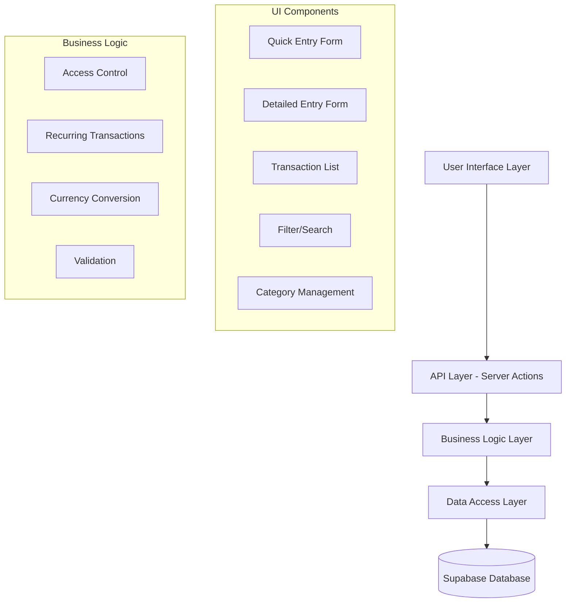
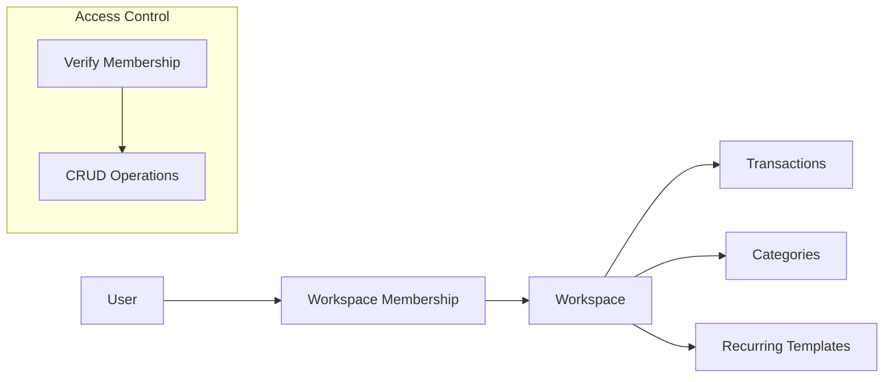

# Design Document: Transactions

## Overview

The Transactions system is the core feature of Forma, designed around a workspace-centric architecture that prioritizes speed of entry (under 5 seconds on mobile) while providing comprehensive management capabilities. The system implements a dual-interface approach: quick entry for mobile users and detailed entry for desktop users, with robust filtering, search, and recurring transaction capabilities.

## Architecture

### High-Level Architecture



### Workspace-Centric Security Model

All transaction operations are controlled through workspace membership:



## Components and Interfaces

### Core Components

#### 1. Transaction Entry Components

**QuickEntryForm** (Mobile-optimized)
```typescript
interface QuickEntryFormProps {
  workspaceId: string
  onSuccess: (transaction: Transaction) => void
  onCancel: () => void
  defaultFilters?: TransactionFilters
}

interface QuickEntryState {
  amount: string
  type: 'income' | 'expense'
  categoryId?: string
  isSubmitting: boolean
}
```

**DetailedEntryForm** (Desktop-optimized)
```typescript
interface DetailedEntryFormProps {
  workspaceId: string
  transaction?: Transaction // For editing
  onSuccess: (transaction: Transaction) => void
  onCancel: () => void
  defaultFilters?: TransactionFilters
}

interface DetailedEntryState {
  amount: string
  type: 'income' | 'expense'
  categoryId?: string
  date: Date
  currency: string
  notes?: string
  isRecurring: boolean
  recurrencePattern?: RecurrencePattern
  isSubmitting: boolean
}
```

#### 2. Transaction List Components

**TransactionList**
```typescript
interface TransactionListProps {
  workspaceId: string
  filters: TransactionFilters
  onTransactionSelect: (transaction: Transaction) => void
}

interface TransactionFilters {
  dateRange: DateRange
  categories: string[]
  type: 'all' | 'income' | 'expense'
  members: string[]
  searchQuery?: string
}
```

**TransactionItem**
```typescript
interface TransactionItemProps {
  transaction: Transaction
  onEdit: (transaction: Transaction) => void
  onDelete: (transactionId: string) => void
  onSwipeLeft: () => void
}
```

#### 3. Filter and Search Components

**TransactionFilters**
```typescript
interface TransactionFiltersProps {
  workspaceId: string
  currentFilters: TransactionFilters
  onFiltersChange: (filters: TransactionFilters) => void
}

interface FilterTabs {
  activeTab: 'all' | 'income' | 'expense'
  onTabChange: (tab: 'all' | 'income' | 'expense') => void
}
```

#### 4. Category Management Components

**CategoryManager**
```typescript
interface CategoryManagerProps {
  workspaceId: string
  categories: Category[]
  onCategoryCreate: (category: Omit<Category, 'id'>) => void
  onCategoryUpdate: (category: Category) => void
  onCategoryDelete: (categoryId: string) => void
  onCategoryMerge: (fromId: string, toId: string) => void
}

interface InlineCategoryCreator {
  onQuickCreate: (name: string) => void
  recentCategories: Category[]
}
```

### Server Actions Interface

```typescript
// Transaction CRUD operations
export async function createTransaction(
  formData: FormData
): Promise<ActionResult<Transaction>>

export async function updateTransaction(
  transactionId: string,
  formData: FormData
): Promise<ActionResult<Transaction>>

export async function deleteTransaction(
  transactionId: string
): Promise<ActionResult<void>>

export async function getTransactions(
  workspaceId: string,
  filters: TransactionFilters,
  pagination: PaginationParams
): Promise<ActionResult<TransactionPage>>

// Category management
export async function createCategory(
  workspaceId: string,
  formData: FormData
): Promise<ActionResult<Category>>

export async function mergeCategories(
  workspaceId: string,
  fromCategoryId: string,
  toCategoryId: string
): Promise<ActionResult<void>>

// Recurring transactions
export async function createRecurringTransaction(
  formData: FormData
): Promise<ActionResult<RecurringTransaction>>

export async function confirmExpectedTransaction(
  expectedTransactionId: string,
  actualAmount?: number
): Promise<ActionResult<Transaction>>
```

## Data Models

### Core Data Structures

```typescript
interface Transaction {
  id: string
  workspace_id: string
  user_id: string // Creator
  amount: number // Always stored in UAH
  original_amount?: number // If foreign currency
  original_currency?: string
  currency: string // Display currency
  type: 'income' | 'expense'
  category_id?: string
  description?: string
  notes?: string
  transaction_date: Date
  is_expected: boolean // For recurring transactions
  expected_transaction_id?: string
  recurring_transaction_id?: string
  created_at: Date
  updated_at: Date
  created_by: string
  updated_by?: string
}

interface Category {
  id: string
  workspace_id: string
  name: string
  icon?: string
  color?: string
  is_default: boolean
  created_at: Date
  updated_at: Date
}

interface RecurringTransaction {
  id: string
  workspace_id: string
  user_id: string
  template_transaction: Omit<Transaction, 'id' | 'created_at' | 'updated_at'>
  frequency: 'daily' | 'weekly' | 'monthly' | 'yearly'
  interval: number // Every N periods
  start_date: Date
  end_date?: Date
  next_due_date: Date
  is_active: boolean
  created_at: Date
  updated_at: Date
}

interface ExpectedTransaction {
  id: string
  recurring_transaction_id: string
  workspace_id: string
  expected_date: Date
  expected_amount: number
  currency: string
  status: 'pending' | 'confirmed' | 'skipped'
  actual_transaction_id?: string
  created_at: Date
}
```

### Database Schema

```sql
-- Transactions table
CREATE TABLE transactions (
  id UUID PRIMARY KEY DEFAULT gen_random_uuid(),
  workspace_id UUID NOT NULL REFERENCES workspaces(id) ON DELETE CASCADE,
  user_id UUID NOT NULL REFERENCES auth.users(id),
  amount DECIMAL(12,2) NOT NULL,
  original_amount DECIMAL(12,2),
  original_currency VARCHAR(3),
  currency VARCHAR(3) NOT NULL DEFAULT 'UAH',
  type VARCHAR(10) NOT NULL CHECK (type IN ('income', 'expense')),
  category_id UUID REFERENCES categories(id),
  description TEXT,
  notes TEXT,
  transaction_date DATE NOT NULL DEFAULT CURRENT_DATE,
  is_expected BOOLEAN NOT NULL DEFAULT FALSE,
  expected_transaction_id UUID REFERENCES expected_transactions(id),
  recurring_transaction_id UUID REFERENCES recurring_transactions(id),
  created_at TIMESTAMPTZ NOT NULL DEFAULT NOW(),
  updated_at TIMESTAMPTZ NOT NULL DEFAULT NOW(),
  created_by UUID NOT NULL REFERENCES auth.users(id),
  updated_by UUID REFERENCES auth.users(id)
);

-- Categories table
CREATE TABLE categories (
  id UUID PRIMARY KEY DEFAULT gen_random_uuid(),
  workspace_id UUID NOT NULL REFERENCES workspaces(id) ON DELETE CASCADE,
  name VARCHAR(100) NOT NULL,
  icon VARCHAR(10),
  color VARCHAR(7),
  is_default BOOLEAN NOT NULL DEFAULT FALSE,
  created_at TIMESTAMPTZ NOT NULL DEFAULT NOW(),
  updated_at TIMESTAMPTZ NOT NULL DEFAULT NOW(),
  UNIQUE(workspace_id, name)
);

-- Recurring transactions table
CREATE TABLE recurring_transactions (
  id UUID PRIMARY KEY DEFAULT gen_random_uuid(),
  workspace_id UUID NOT NULL REFERENCES workspaces(id) ON DELETE CASCADE,
  user_id UUID NOT NULL REFERENCES auth.users(id),
  template_data JSONB NOT NULL,
  frequency VARCHAR(10) NOT NULL CHECK (frequency IN ('daily', 'weekly', 'monthly', 'yearly')),
  interval_count INTEGER NOT NULL DEFAULT 1,
  start_date DATE NOT NULL,
  end_date DATE,
  next_due_date DATE NOT NULL,
  is_active BOOLEAN NOT NULL DEFAULT TRUE,
  created_at TIMESTAMPTZ NOT NULL DEFAULT NOW(),
  updated_at TIMESTAMPTZ NOT NULL DEFAULT NOW()
);

-- Expected transactions table
CREATE TABLE expected_transactions (
  id UUID PRIMARY KEY DEFAULT gen_random_uuid(),
  recurring_transaction_id UUID NOT NULL REFERENCES recurring_transactions(id) ON DELETE CASCADE,
  workspace_id UUID NOT NULL REFERENCES workspaces(id) ON DELETE CASCADE,
  expected_date DATE NOT NULL,
  expected_amount DECIMAL(12,2) NOT NULL,
  currency VARCHAR(3) NOT NULL DEFAULT 'UAH',
  status VARCHAR(10) NOT NULL DEFAULT 'pending' CHECK (status IN ('pending', 'confirmed', 'skipped')),
  actual_transaction_id UUID REFERENCES transactions(id),
  created_at TIMESTAMPTZ NOT NULL DEFAULT NOW()
);

-- Indexes for performance
CREATE INDEX idx_transactions_workspace_date ON transactions(workspace_id, transaction_date DESC);
CREATE INDEX idx_transactions_category ON transactions(category_id);
CREATE INDEX idx_transactions_type ON transactions(type);
CREATE INDEX idx_transactions_user ON transactions(user_id);
CREATE INDEX idx_expected_transactions_due_date ON expected_transactions(expected_date);
```

## Error Handling

### Access Control Errors

```typescript
class WorkspaceAccessError extends Error {
  constructor(userId: string, workspaceId: string) {
    super(`User ${userId} does not have access to workspace ${workspaceId}`)
    this.name = 'WorkspaceAccessError'
  }
}

class TransactionNotFoundError extends Error {
  constructor(transactionId: string) {
    super(`Transaction ${transactionId} not found`)
    this.name = 'TransactionNotFoundError'
  }
}
```

### Validation Errors

```typescript
// Using Zod for validation
const transactionSchema = z.object({
  amount: z.number().positive('Amount must be positive'),
  type: z.enum(['income', 'expense']),
  currency: z.string().length(3, 'Invalid currency code'),
  category_id: z.string().uuid().optional(),
  description: z.string().max(255).optional(),
  notes: z.string().max(1000).optional(),
  transaction_date: z.coerce.date(),
  workspace_id: z.string().uuid()
})
```

### Currency Conversion Errors

```typescript
class CurrencyConversionError extends Error {
  constructor(fromCurrency: string, toCurrency: string, date: Date) {
    super(`Unable to convert ${fromCurrency} to ${toCurrency} for date ${date.toISOString()}`)
    this.name = 'CurrencyConversionError'
  }
}
```

## Testing Strategy

### Unit Testing Approach

**Component Testing**
- Test transaction entry forms with various input combinations
- Test filter and search functionality
- Test category management operations
- Mock server actions and test UI behavior

**Server Action Testing**
- Test CRUD operations with valid and invalid data
- Test workspace access control enforcement
- Test currency conversion logic
- Test recurring transaction creation and management

**Validation Testing**
- Test Zod schema validation with edge cases
- Test business rule enforcement
- Test data integrity constraints

### Integration Testing Approach

**Database Integration**
- Test transaction creation with workspace relationships
- Test category assignment and management
- Test recurring transaction processing
- Test RLS policy enforcement

**Currency Integration**
- Test NBU API integration for exchange rates
- Test fallback to cached rates
- Test currency conversion accuracy

**Authentication Integration**
- Test workspace membership verification
- Test user session handling
- Test cross-workspace access prevention

## Correctness Properties

*A property is a characteristic or behavior that should hold true across all valid executions of a system-essentially, a formal statement about what the system should do. Properties serve as the bridge between human-readable specifications and machine-verifiable correctness guarantees.*

Based on the prework analysis, the following properties ensure the transactions system behaves correctly across all inputs:

### Property 1: Category Ordering Consistency
*For any* category selection interface, categories should be ordered by usage frequency with most recent/frequent categories appearing first
**Validates: Requirements 1.4**

### Property 2: Default Category Assignment
*For any* transaction created without an explicit category selection, the system should assign the workspace's default category
**Validates: Requirements 1.5**

### Property 3: Quick Entry Timestamp Accuracy
*For any* transaction created via quick entry, the system should assign the current date and time as the transaction timestamp
**Validates: Requirements 1.9**

### Property 4: Type-Ahead Search Functionality
*For any* search query in the category field, the system should return categories containing the query string, ordered by relevance
**Validates: Requirements 2.4**

### Property 5: Form Cancellation with Data Protection
*For any* form with entered data, pressing escape should prompt for confirmation before discarding changes
**Validates: Requirements 2.6**

### Property 6: Currency Conversion Round Trip
*For any* foreign currency transaction, converting to UAH and displaying both amounts should maintain mathematical accuracy within acceptable precision
**Validates: Requirements 2.8**

### Property 7: Transaction List Chronological Ordering
*For any* set of transactions, the default list display should order them by transaction date in descending order (most recent first)
**Validates: Requirements 3.1**

### Property 8: Transaction Display Format Consistency
*For any* transaction displayed in the list, it should show date, amount, category, and type, with income amounts in Growth Emerald color and expense amounts in default text color
**Validates: Requirements 3.2, 3.3, 3.4**

### Property 9: Transaction Navigation Consistency
*For any* transaction in the list, tapping it should open the detail view for editing that specific transaction
**Validates: Requirements 3.6**

### Property 10: Search Query Filtering
*For any* text search query, the system should return only transactions whose notes field contains the query string (case-insensitive)
**Validates: Requirements 4.5**

### Property 11: Filter State Persistence
*For any* combination of active filters, the filter state should persist throughout the user session until explicitly changed
**Validates: Requirements 4.7**

### Property 12: Filter Context Application
*For any* active filters when creating a new transaction, those filters should pre-populate the appropriate fields in the creation form
**Validates: Requirements 4.8**

### Property 13: Edit Form Pre-Population
*For any* transaction being edited, the edit form should be pre-populated with all current field values
**Validates: Requirements 5.2**

### Property 14: Edit Audit Trail
*For any* transaction edit operation, the system should update both the "last modified" timestamp and "modified by" user field
**Validates: Requirements 5.4, 5.5**

### Property 15: Transaction Deletion Consistency
*For any* confirmed transaction deletion, the transaction should be immediately removed from the list and soft-deleted in the database
**Validates: Requirements 6.2, 6.4**

### Property 16: Category Deletion Business Rule
*For any* category with assigned transactions, deletion attempts should be rejected with an appropriate error message
**Validates: Requirements 7.4**

### Property 17: Category Merge Transaction Reassignment
*For any* category merge operation, all transactions assigned to the source category should be reassigned to the target category
**Validates: Requirements 7.5**

### Property 18: Transaction Type Family Constraint
*For any* custom transaction type creation, the type must be assigned to either the Income or Expense family
**Validates: Requirements 8.3**

### Property 19: Recurring Transaction Pattern Generation
*For any* recurring transaction template, the system should generate expected transactions according to the specified frequency pattern
**Validates: Requirements 9.4**

### Property 20: Expected Transaction Visual Distinction
*For any* expected transaction in the list, it should be visually distinguished from confirmed transactions (e.g., dashed border)
**Validates: Requirements 9.5**

### Property 21: Expected Transaction Confirmation
*For any* expected transaction confirmation, the system should create a confirmed transaction and mark the expected transaction as completed
**Validates: Requirements 9.6, 9.7**

### Property 22: Workspace Access Control
*For any* transaction operation (create, read, update, delete), the system should verify the user is a member of the transaction's workspace before allowing the operation
**Validates: Requirements 10.1, 10.2, 10.3, 10.4**

### Property 23: Transaction Workspace Isolation
*For any* transaction, it should be linked to exactly one workspace and should never be accessible from other workspaces regardless of user permissions
**Validates: Requirements 10.5, 10.6**

### Property 24: Recurring Transaction Skip Functionality
*For any* expected transaction, the user should be able to skip the occurrence, marking it as skipped without creating a confirmed transaction
**Validates: Requirements 9.8**

## Testing Strategy

### Dual Testing Approach

The transactions system requires both unit tests and property-based tests for comprehensive coverage:

**Unit Tests** focus on:
- Specific UI interactions (button clicks, form submissions)
- Edge cases and error conditions
- Integration points between components
- Specific business scenarios

**Property-Based Tests** focus on:
- Universal behaviors across all transaction data
- Data integrity and consistency
- Access control enforcement
- Currency conversion accuracy

### Property-Based Testing Configuration

Each property test should:
- Run minimum 100 iterations to ensure comprehensive input coverage
- Use realistic data generators for transactions, categories, and users
- Test against both valid and boundary conditions
- Reference the corresponding design document property

**Tag Format**: `Feature: transactions, Property {number}: {property_text}`

### Test Data Generation Strategy

**Transaction Generator**:
```typescript
const generateTransaction = (): Transaction => ({
  id: faker.string.uuid(),
  workspace_id: faker.string.uuid(),
  user_id: faker.string.uuid(),
  amount: faker.number.float({ min: 0.01, max: 999999.99, precision: 0.01 }),
  currency: faker.helpers.arrayElement(['UAH', 'USD', 'EUR']),
  type: faker.helpers.arrayElement(['income', 'expense']),
  category_id: faker.string.uuid(),
  description: faker.commerce.productName(),
  transaction_date: faker.date.recent(),
  // ... other fields
})
```

**Category Generator**:
```typescript
const generateCategory = (workspaceId: string): Category => ({
  id: faker.string.uuid(),
  workspace_id: workspaceId,
  name: faker.commerce.department(),
  icon: faker.internet.emoji(),
  is_default: faker.datatype.boolean(),
  // ... other fields
})
```

**Edge Case Generators**:
- Boundary amounts (0.01, 999999.99)
- Date boundaries (past, future, today)
- Empty and maximum length strings
- Invalid workspace/user combinations for access control testing
